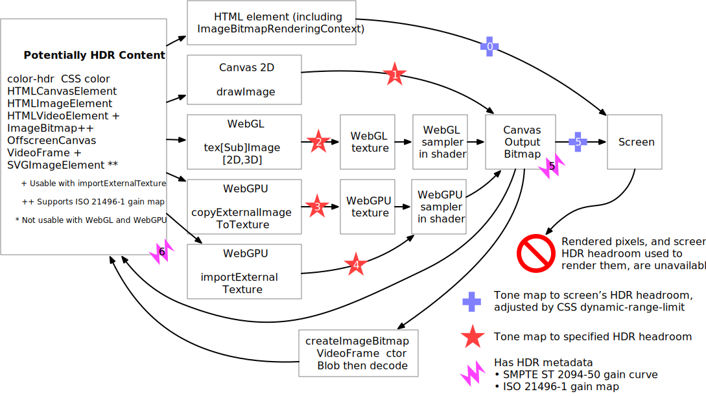

# HDR on the web, the big picture

This document provides and overview of
the many changes to many specifications
needed to provide a complete strategy for high dynamic range (HDR) on the web.

This is an elaboration of [this spreadsheet](https://docs.google.com/spreadsheets/d/1zq6vhz3w2aCp9sgCidpGncQxybaDyBBr9p3nVqASaUQ/edit?usp=sharing) tracking various HDR related features.
These specification changes affect many features covering many different areas, including:
CSS, 2D canvas, WebGL, WebGPU, and WebCodecs.

This document proposes to achieve an alignment about high level concept and directions (e.g, how to encode HDR headroom) across all APIs here in the [color on the web community group](https://www.w3.org/groups/cg/colorweb/).
From there, the details of the individual specification changes can be taken care of in their respective groups.

The following image shows an overview of the treatment of HDR content.
The numbered symbols indicate features that need to be added (except 0), and proposes an order for adding them.

There three broad components of the feature work:
* The "blue crosses" are for [displaying HDR elements](#displaying-html-elements-and-the-dynamic-range-limit-css-property)
* The "red stars" are for [drawing HDR content to a buffer](#drawing-hdr-content-to-a-bitmap-or-texture)
* The "magenta suns" are for [attaching HDR metadata to canvases](#displaying-an-hdr-canvas)

## Background

### HDR definition and not-definitions

HDR, on the web, means "can go brighter than the CSS color `white`".

HDR does not refer to high bit depth.
High bit depth is useful to HDR,
but it has uses independent of HDR.

HDR does not mean wide color gamut.
Wide color gamut can be useful to HDR,
but it has uses independent of HDR.

HDR on the web is not [Recommendation ITU-R BT.2100](https://www.itu.int/rec/r-rec-bt.2100) Hybrid-Log Gamma (HLG) or Perceptual Quantizer (PQ).
Those are common image and video encodings for HDR content, but are not the only way to express HDR content.

### HDR headroom

HDR headroom is defined as the ratio of peak luminance (of a thing) to the luminance of `white` (in that thing).

It is often (e.g, in
[ISO 21496-1](https://www.iso.org/standard/86775.html) gain map images and
[SMPTE ST 2094-50](https://github.com/SMPTE/st2094-50))
defined as the log base 2 of that ratio.

In many discussions of web specifications this encoding in log2 has been controversial,
and a preference for representation as a linear encoding has been indicated.
This document will use the verbose but unambiguous term "linear HDR headroom".

### HDR display definition and characterization

A display is HDR capable if it can produce colors brighter than `white`.

A display's HDR capability is quantified by its linear HDR headroom.
A display is HDR if its linear HDR headroom is greater than 1.
A display is standard dynamic range (SDR) only if its linear HDR headroom is equal to 1.

SDR displays are important and will be with us forever.
This strategy must be well-defined and high quality in SDR.
The personal choice to disable colors brighter than `white` will be with us forever.
Print is SDR (in this definition) and is forever.
E-ink is SDR (in this definition) and is forever.

### HDR image definition

An image is HDR if it specifies colors brighter than `white`.

This can be specified directly as pixel values (e.g, a PQ image),
or it can be specified by metadata (e.g, an ISO 21496-1 gain map image).

### Headroom-adaptive tone mapping characterization

Tone mapping is the process of transforming an image for display
at a specified targeted HDR headroom.
The only parameter for tone mapping is the targeted HDR headroom.
There are no other parameters.

All images that are HDR specify how they are to be tone mapped to any targeted HDR headroom value. This transformation is image-dependent and is specified by metadata.

* An example of such metadata is
an ISO 21496-1 gain map image.
This specifies an entirely independent image to display at a specified targeted headroom, and interpolation for intermediate targeted headrooms.
* Another example of such metadata is
an ICC or SMPTE ST 2094-50 adaptive gain curve.
This specifies a global tone mapping operation.

An important property about these metadata is that they _prescribe_ an exact tone mapped color value for every pixel of the image or video, for every targeted headroom.
This is different from _descriptive_ metadata that describes the scene but leaves the transformation up to the implementation.

A default treatment for images that contain no open standard metadata should be agreed upon.
A good candidate is the reference white tone mapping operator currently in draft at
[ISO/DIS 22028-5](https://www.iso.org/standard/81863.html#draft), and in draft (not yet available) in SMPTE ST 2094-50, but this document does not cover this topic any further.

## Core features

### Displaying HTML elements, and the [`dynamic-range-limit`](https://www.w3.org/TR/css-color-hdr-1/#the-dynamic-range-limit-property) CSS property

All image and video elements are transformed to the HDR headroom of the window when they are displayed.

The user agent decides what the HDR headroom for a window is.
It may be the same as the HDR headroom of the current screen,
or it may some lower value, e.g, for background windows, for battery considerations, or based on user preferences.

The window's HDR headroom is a very high precision fingerprinting vector and is not to be exposed to via javascript.

The [`dynamic-range-limit`](https://www.w3.org/TR/css-color-hdr-1/#the-dynamic-range-limit-property) CSS property may be specified on elements to indicate that they should be further restricted.
This property applies to images, videos, canvases, and CSS colors.

### Drawing HDR content to a bitmap or texture

HDR images can be rendered an infinite number of ways, depending on the HDR headroom at which they are to be rendered.

There exists a general problem wherein an HDR image must be put into pixels in a buffer. At the moment the HDR image is put into pixels in a buffer, this infinite number of ways of representing it must be collapsed into a single representation at a specific HDR headroom.

This general problem has instances in 2D canvas, WebGL, and WebGPU.

* For 2D canvas, the [`drawImage`](https://html.spec.whatwg.org/multipage/canvas.html#canvasdrawimage) and similar functions exposed by the `CanvasDrawImage` interface included in `CanvasRenderingContext2D` and `OffscreenCanvasRenderingContext2D` perform this operation.
[This explainer](https://github.com/ccameron-chromium/ColorWeb-CG/blob/master/canvas2d_hdr_headroom.md) proposes adding a `globalHDRHeadroom` attribute to the [`CanvasCompositing`](https://html.spec.whatwg.org/multipage/canvas.html#canvascompositing) interface.
* For WebGL, the `texImage2D` and related functions perform this operation. [This explainer](https://github.com/ccameron-chromium/ColorWeb-CG/blob/master/webgl_hdr_headroom.md) proposes adding a `unpackHDRHeadroom` attribute to the [`WebGLRenderingContextBase`](https://registry.khronos.org/webgl/specs/latest/1.0/#5.14) interface.
* For WebGPU, the [`copyExternalImageToTexture`](https://www.w3.org/TR/webgpu/#dom-gpuqueue-copyexternalimagetotexture) and [`importExternalTexture`](https://www.w3.org/TR/webgpu/#dom-gpudevice-importexternaltexture) functions perform this operation. [This explainer](https://github.com/ccameron-chromium/ColorWeb-CG/blob/master/webgpu_hdr_headroom.md) proposes adding an `hdrHeadroom` parameter to the [`GPUCopyExternalImageDestInfo`](https://www.w3.org/TR/webgpu/#gpucopyexternalimagedestinfo) and [`GPUExternalTextureDescriptor`](https://www.w3.org/TR/webgpu/#external-texture-creation) dictionaries.

The default behavior for all of these APIs is for them to tone map to SDR.
That way, any application that is oblivious to HDR will produce good results (as opposed to having out of range values clamped, etc).

None of these interfaces provide a way to get at the "raw pixels" of the image.

* An SDR image can be encoded using P3 pixel values versus Rec2020 pixel values, and that detail is not visible to these interfaces.
* An HDR image can be encoded using Display P3 as the pixel values (and a gain map or gain curve to go up to HDR) or as PQ as the pixel values (and a gain map or gain curve to go down to SDR), and that detail is not visible to these interfaces.

These explainers are all written against the idea of specifying HDR headroom in log2 space. The preference for linear space has since been indicated.

* The `globalHDRHeadroom` parameter should be renamed to `globalLinearHDRHeadroom` if a linear encoding is to be used
* The `unpackHDRHeadroom` parameter should be renamed to `unpackLinearHDRHeadroom`
* The `hdrHeadroom` parameter should be renamed to `linearHDRHeadroom`

The valid range of values for the linear parameter is [1, `Infinity`].

### Displaying an HDR canvas

#### Trivial tone mapping

The default behavior for all HTML canvas elements is to limit their contents to the SDR color volume of the target display. In WebGPU, a canvas can instead allow use of the full HDR color volume of the target display via the [`GPUCanvasToneMapping`](https://gpuweb.github.io/gpuweb/#dictdef-gpucanvastonemapping) structure.

In both of these cases, the transformation performed by tone mapping is the trivial tone mapping operation of "do nothing". The pixel values are unchanged regardless of the targeted headroom. See the next section for more involved tone mapping.

This behavior was limited to WebGPU because, at the time of writing, only WebGPU supported pixel formats that allowed expressing values outside of SDR color volumes. This has since been addressed for [2D contexts](https://github.com/whatwg/html/issues/8708) and for [WebGL](https://github.com/KhronosGroup/WebGL/pull/3222).
The WebGPU explainer [indiciated](https://github.com/ccameron-chromium/webgpu-hdr/blob/main/EXPLAINER.md#notes-on-canvasrenderingcontext2d-and-unification-of-apis) that this API should be generalized.

[This 2D canvas explainer](https://github.com/ccameron-chromium/ColorWeb-CG/blob/master/canvas2d_tone_map.md) and [explainer PR](https://github.com/whatwg/html/pull/11734) add these parameters to the HTML specification, and allow the [`CanvasRenderingContext2DSettings`](https://html.spec.whatwg.org/multipage/canvas.html#canvasrenderingcontext2dsettings) to specify them.

[This WebGL explainer](https://github.com/ccameron-chromium/webgl-hdr/blob/master/EXPLAINER.md) indicates how these parameters would be added to WebGL, though it is somewhat out-of-date.

#### Using SMPTE ST 2094-50 metadata

The SMPTE ST 2094-50 specification defines non-trivial global tone mapping.

Once all APIs (2D, WebGL, and WebGPU) are use the same `CanvasToneMapping` interface described above, we can add support for tone mapping using SMPTE ST 2094-50 metadata to that interface, and it will be supported by all APIs.

[This explainer](https://github.com/ccameron-chromium/ColorWeb-CG/blob/master/smpte_st_2094_50.md) proposes such an interface.
That explainer proposes using a `Blob`, but it may be better to have an `interface` for SMPTE ST 2094-50 metadata.
It is likely that we will want to add some constructors for common curves (e.g, the aforementioned reference white tone mapping operator).

SMPTE ST 2094-50 will be supported in videos and in images, and so exporting a canvas to an image or streaming it to a video will be supported.

### Accessing SMPTE ST 2094-50 metadata via WebCodecs

[That same explainer](https://github.com/ccameron-chromium/ColorWeb-CG/blob/master/smpte_st_2094_50.md) proposes adding SMPTE ST 2094-50 metadata to the [VideoFrame Metadata Registry](https://w3c.github.io/webcodecs/video_frame_metadata_registry.html).

### CSS HDR Colors

The [hdr-color](https://drafts.csswg.org/css-color-hdr/#funcdef-hdr-color) functional allows specifying a color at several different HDR headrooms.
This allows an CSS color to color match a pixel in an HDR image at all HDR headrooms.

CSS colors using this functional will be affected by the `dynamic-range-limit` when rendering to the screen, and will be affected by the `globalHDRHeadroom` when rendering to a 2D canvas.

This specification also [defines HDR headroom](https://drafts.csswg.org/css-color-hdr/#hdr-headroom) using a log2 representation.
We should use the same convention (log2 versus linear) between CSS, 2D canvas, WebGL, and WebGPU.

### Detecting HDR capability

The [`dynamic-range`](https://www.w3.org/TR/mediaqueries-5/#dynamic-range) media query can report if the current screen is HDR or SDR.

Exactly how HDR the screen is, what its HDR headroom is, however, is not query-able.

## Example, how do I use the canvas APIs?

The question of "how would I use these APIs" often comes up.

If you doesn't want to do HDR, then you can just pretend these APIs don't exist. All canvas operations on all APIs will result in a canvas that renders content the same way it would appear on an SDR screen.

### Media carousel

Suppose you have an application that is just drawing a bunch of images or videos.

The first thing to do is to decide the "mastering HDR headroom" (this is like the Mastering Display Color Volume in SMPTE ST 2086). A good value for this would be 4x in linear space.

You'll set the `globalLinearHDRHeadroom` or `unpackLinearHDRHeadroom` or `linearHDRHeadroom` parameter to 4 when importing assets.
And, you'll just draw stuff as normal.

You'll configure your canvas to use SMPTE ST 2094-50 metadata indicating that the baseline HDR headrom is 4x (beware that in the parlance of that spec, everything is log2), and indicating the tone mapping curve to go to lower HDR headrooms (or just going with one of the pre-defined curves).

The user agent will then tone map to "whatever the actual HDR headroom of the display is".

### Physically based rendering

Suppose you have an application that is doing physically based rendering, where you're producing scene-referred luminance values in some buffer.

Once you have those scene-referred luminance values, you'll again decide what your "mastering HDR headroom" is.
Let's say you decide it's 4.

You will tone map your scene-referred luminance values to display-referred with linear HDR headroom 4, and write them in the backbuffer.
(Note that the mapping scene-referred values to display-referred values is called "tone mapping" and mapping display-referred values at headroom X to headroom Y is also called, confusingly, "tone mapping").

Maybe, if you arrange things right, you can manage to have this scene-referred to display-referred mapping be a no-op. But in general, physically-based scene-referred dynamic range is ginormous and totally unsuitable for direct display.

You'll then configure your canvas to use SMPTE ST 2094-50 metadata indicating how to tone map display-referred at 4x to other headroom values.

## Dependencies and making forward progress

The list of spec changes to make is fairly ginormous, and so there is a question of what to do and in what order.

### No dependencies at all: `CanvasToneMapping`

The proposal ([explainer](https://github.com/ccameron-chromium/ColorWeb-CG/blob/master/canvas2d_tone_map.md), [spec pre-review-PR](https://github.com/whatwg/html/pull/11734), [issue](https://github.com/whatwg/html/issues/11424)) to move WebGPU's tone mapping API to HTML canvas has nothing it depends on.

This can be done now.

After this is done, the [WebGL version](https://github.com/KhronosGroup/WebGL/issues/3666) can be done, and the WebGPU spec can be updated to link to the HTML spec (as it already does for color spaces).

### Depends only on log2 vs linear encoding: drawing images to bitmaps and textures

We need to decide if all APIs will use linear or log2 HDR headroom.

Once we do that, we can land
* [`globalHDRHeadroom`](https://github.com/whatwg/html/issues/11165) in 2D
* [`unpackHDRHeadroom`](https://github.com/KhronosGroup/WebGL/issues/3735) in WebGL
* [`hdrHeadroom`](https://github.com/gpuweb/gpuweb/issues/5236) in WebGPU

We can use images with existing and published headroom-parameterized tone mapping for WPT and conformance tests.

We can write tests for `hdr-color` in 2D canvas.

### Depends on SMPTE ST 2094-50

Once SMPTE ST 2094-50 is published, we can add support in the aforementioned `CanvasToneMapping` API, as well as WebCodecs.
That is outlined in [this explainer](https://github.com/ccameron-chromium/ColorWeb-CG/blob/master/smpte_st_2094_50.md).

We can beef up existing tests with images of this format, and we can add tests ensuring that image encoding and video streaming are supported.

