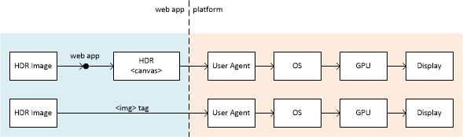
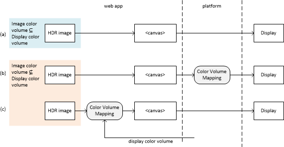
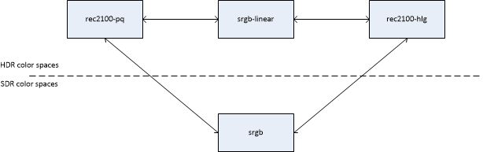

# Adding support High Dynamic Range (HDR) imagery to HTML Canvas: a baseline proposal (version 2)

## Introduction

Today [HTML
Canvas](https://html.spec.whatwg.org/multipage/canvas.html#imagedata) supports
only 8 bit per color channel and two `PredefinedColorSpace` color spaces (`srgb`
and `display-p3`).

This is insufficient for High-Dynamic Range (HDR) imagery, which is in
widespread use today:

* As detailed, for example, at [Ultra HD Blu-ray Format Video Characteristics
](https://ieeexplore.ieee.org/document/7514362), 8-bit quantization (bit depth)
results in contouring and banding, even for traditional standard dynamic range
(SDR) imagery, like sRGB, which covers a typical luminance range between 0 and
100 cd/m<sup>2</sup>. These quantization artifacts become unacceptable with
High-Dynamic Range (HDR) imagery, which supports luminance ranges between 0 and
up to 10,000 cd/m<sup>2</sup>.

* As specified at [Rec. ITU-R BT.2100](https://www.itu.int/rec/R-REC-BT.2100),
two color spaces tailored for HDR imagery have been developed: BT.2100 PQ and
BT.2100 HLG. All movies and TV shows are distributed using either of these two
color spaces. Products with HDMI and/or DisplayPort interfaces also use these
color spaces for HDR support.

* To reproduce an HDR image on a display, it is useful to have information on
both the color volume of that display and the color volume of the image since
one can be significantly smaller than the other.

Accordingly, the following API modifications are needed to manipulate HDR images
in HTML Canvas:

1. add BT.2100 PQ and BT.2100 HLG color spaces to `PredefinedColorSpace`
2. add higher bit depth capabilities to `CanvasRenderingContext2DSettings`
3. add higher bit depth capabilities to `ImageDataSettings`
4. add image color volume information to `ImageDataSettings` and
   `CanvasRenderingContext2DSettings`
5. add display color volume information to the `Screen` interface of the CSS
   Object Model, to determine the characteristics of the display on which the
   image is being reproduced

## Target use cases

As illustrated below, the primary use case is the drawing of HDR images into an
HTML Canvas element such that the images are displayed as they would have been
if they had been introduced in an `img` or `video` element.



Example applications include:

* drawing images retrieved from a file whose format is not supported by the
  `img` or `video` elements
* collage of images, both HDR and SDR
* adding graphics to an HDR image
* drawing of visual elements that are related to an HDR presentation in a
 `video` element, with the expectation that the former match the look of the
 latter
* authoring HDR images

## Scope

We propose a minimal extension to the Web Platform to allow the HTML Canvas API
to manipulate High Dynamic Range (HDR) images expressed using the widespread
BT.2100 PQ and BT.2100 HLG color spaces.

This proposal:

* does not preclude adding other HDR capabilities to HTML Canvas, such as
  support for additional color spaces like a linear high-dynamic range color
  space.
* neither specifies nor requires new capabilities for compositing `canvas`
  elements with other HTML elements.

## Add color spaces intended for use with HDR images

### General

Extend [`PredefinedColorSpace`](https://html.spec.whatwg.org/multipage/canvas.html#predefinedcolorspace) to
include the following HDR color spaces.

```idl
  partial enum PredefinedColorSpace {
    /*
     * Currently defined values: "srgb", "display-p3"
     */

    "rec2100-hlg",
    "rec2100-pq",
  }
```

Extending `PredefinedColorSpace` automatically extends
`CanvasRenderingContext2DSettings` and `ImageDataSettings`.

A Canvas that is initialized with an HDR color space is an HDR Canvas; otherwise
it is an SDR Canvas.

When drawing an image into a Canvas, the image will be transformed unless the
color spaces of the image and the Canvas match. Annex A specifies transformation
to and from `rec2100-pq` and `rec2100-hlg`.

### rec2100-hlg

The non-linear component signals {R', G', B'} are mapped to red, green and blue
tristimulus values according to the Hybrid Log-Gamma (HLG) system specified in
Rec. ITU-R BT.2100.

### rec2100-pq

The non-linear component signals {R', G', B'} are mapped to red, green and blue
tristimulus values according to the Perceptual Quantizer (PQ) system system
specified in Rec. ITU-R BT.2100.

_NOTE: {R', G', B'} are in the range [0, 1], i.e. they are not expressed in
cd/m<sup>2</sup>_

## Extend `CanvasRenderingContext2DSettings` to support higher bit depths

Add to `CanvasRenderingContext2DSettings` a `CanvasDataType` member that
specifies the representation of each pixel of the [output bitmap](https://html.spec.whatwg.org/multipage/canvas.html#output-bitmap) of a
`CanvasRenderingContext2D` and `OffscreenCanvasRenderingContext2D`.

```idl
  partial dictionary CanvasRenderingContext2DSettings {
    /*
     * Currently defined attributes:
     *
     * boolean alpha = true;
     * boolean desynchronized = false;
     * PredefinedColorSpace colorSpace = "srgb";
     * boolean willReadFrequently = false;
     */

    CanvasDataType dataType = "unorm8";
  };
```

```idl
  enum CanvasDataType {
    "unorm8",
    "float16",
  };
```

When `dataType = "unorm8"`, the non-linear component signals {R', G', B'} are
quantized using full range quantization, i.e. they are multiplied by 255 and
rounded to the nearest integer. For example, R' = 0.5 is represented by the
integer value 128.

When `dataType = "float16"`, the non-linear component signals {R', G', B'} are
not quantized, i.e. R' = 0.5 is represented by the floating point value 0.5.

_NOTE: `dataType = "unorm8"` corresponds to HTML Canvas as it exists today and
should not be used to represent HDR signal, as detailed in the introduction._

## Extend `ImageDataSettings` to support higher bit depths

Add to
[`ImageDataSettings`](https://html.spec.whatwg.org/multipage/canvas.html#imagedatasettings)
a `ImageDataType` member that specifies the conversion semantics and type of
each of the items of the `data` member array of `ImageData`.

```idl
  partial dictionary ImageDataSettings {
    /*
     * Currently defined attributes:
     *
     * PredefinedColorSpace colorSpace;
     */

    ImageDataType dataType = "unorm8";
  };
```

```idl
  enum ImageDataType {
    "unorm8",
    "float16",
    "float32"
    // and potentially others
  };
```

The values `"unorm8"`, `"float16"` and `"float32"` result in `data` returning an
array with the type `Uint8ClampedArray`, `Float16Array`, `Float32Array`,
respectively.

_NOTE: The strawman requires at least one of `"float16"` and `"float32"` to
support HDR imagery. Both are listed above to emphasize that the strawman can
work with both or either._

## Add HDR rendering behavior and HDR metadata to `CanvasRenderingContext2DSettings`

Add a new CanvasColorMetadata dictionary:

```idl
dictionary CanvasColorMetadata {
  ColorVolumeInfo colorVolumeMetadata;
}
```

```idl
  dictionary Chromaticities {
    // The color primaries and white point of a color volume, in CIE 1931 xy
    // coordinates.
    required double redPrimaryX;
    required double redPrimaryY;
    required double greenPrimaryX;
    required double greenPrimaryY;
    required double bluePrimaryX;
    required double bluePrimaryY;
    required double whitePointX;
    required double whitePointY;
  }
```

```idl
dictionary ColorVolumeInfo {
  optional Chromaticities chromaticity;
  optional double minimumLuminance;
  optional double maximumLuminance;
}
```

Add a mechanism for specifying this on `CanvasRenderingContext2D` and
`OffscreenCanvasRenderingContext2D`.

```idl
  partial interface CanvasRenderingContext2D/OffscreenCanvasRenderingContext2D {
    attribute CanvasColorMetadata colorMetadata;
  }
```

`colorVolumeMetadata` specifies the nominal color volume occupied by
the image content in the CIE 1931 XYZ color space. The boundaries of the color
volume are defined by:

* the xy coordinates, as defined in [ISO
  11664-3](https://www.iso.org/standard/74165.html), of three color primaries:
  `redPrimaryX`, `redPrimaryY`, `greenPrimaryX`, `greenPrimaryY`,
  `bluePrimaryX`, and `bluePrimaryY`;
* the xy coordinates of a white point: `whitePointX` and `whitePointY`; and
* a minimum and maximum luminance in cd/m²: `minimumLuminance` and `maximumLuminance`.

If omitted, `chromaticities` is equal to the chromaticity of the color space of
the Canvas.

If omitted, `minimumLuminance` is equal to 0 cd/m².

If omitted, `maximumLuminance` is equal to 1,000 cd/m².

The color volume is nominal because it MAY be smaller or larger than the actual
color volume of image content, but SHOULD not be smaller.

If present, `colorVolumeMetadata` SHOULD completely define the color volume mapping
algorithm used when rendering the image to a display. For example, the
_rec2100-pq to srgb_ mapping specified in Annex A uses the `minimumLuminance`
and `maximumLuminance` parameters.

If `colorVolumeMetadata` is not present, the color volume mapping algorithm is left
entirely to the implementation.

`colorVolumeMetadata` SHOULD be set if known, e.g. if obtained from metadata
contained in a source image, and omitted otherwise. This is particularly
important when drawing a temporal sequence of images. If `colorVolumeMetadata`
is not set, the color volume mapping algorithm can vary over the sequence, resulting in
temporal artifacts.

For example, `colorVolumeMetadata` can be set according to the Mastering Display
Color Volume and Content Light Level Information chunks found in a PNG image:
the color volume of the image content is typically smaller than, or coincides
with, that of the mastering display. For the color primaries and white point of
the color volume, the colour primaries and white point parameters of the
Mastering Display Color Volume chunk can be used. For the `minimumLuminance`
parameter, the minimum luminance parameter of the Mastering Display Color Volume
chunk can be used. For the `maximumLuminance` parameter, the MaxCLL parameter of
the Content Light Level Information chunk can provide more accurate information
than the maximum luminance parameter of the Mastering Display Color Volume
chunk.

As specified below, the platform does not generally apply color volume mapping
if the color volume of the image is smaller than that of the display.

## Add display color volume information to `Screen` interface of the CSS Object Model

Add a new `displayColorVolume` attribute to the `Screen` interface:

```idl
partial interface Screen {
  optional ColorVolumeInfo displayColorVolume;
}
```

If present, the `displayColorVolume` attribute specifies the set of colors that
the screen of the output device can reproduce without significant color volume
mapping.

If omitted, the values of `chromaticity`, `minimumLuminance` and
`maximumLuminance` are unspecified.

It is preferable to omit `displayColorVolume` than to provide default or nominal
values that are not known to be valid or accurate.

`displayColorVolume` can, for example, be used in the following scenarios:

* an authoring application can use the information to (i) avoid image colors
  exceeding the color volume of the output device and (ii) correspondingly set
  `colorVolumeMetadata` in `CanvasColorMetadata` (see above).
* a player application can use the information to map the colors of the image to
  the color volume of the output device if some of the former are outside the
  latter -- this allows the application to use its own mapping algorithm,
  substituting those provided by the underlying platform.

In absence of `displayColorVolume`:

* the [`dynamic-range`](https://drafts.csswg.org/mediaqueries-5/#dynamic-range)
media query can be used to determine whether the output device supports
high-dynamic range imagery; and
* the
[`color-gamut`](https://drafts.csswg.org/mediaqueries-5/#descdef-media-color-gamut)
media query feature can be used to determine whether the output device supports
wide color gamut imagery.

## Color Volume Mapping

As illustrated by (b) below, when the the color volume of the image is not a
subset of the color volume of the display, the platform performs color volume
mapping, i.e. modifies the colors of the image to make them fit within the
capabilities of the display.

Conversely and as illustrated by (a) below, the platform does not perform color
volume mapping if the color volume of the image is a subset of the color volume
of the display.

It is possible for an application to avoid color volume mapping by the platform
by ensuring that the color volume of the image, as specified
by`colorVolumeMetadata`, is within `displayColorVolume`. This can be achieved,
for example, by:

* preventing in the first place an author from creating colors exceeding the
  display color volume.
* the application performing its own color volume mapping such that the
  resulting image color volume is within the display color volume, as
  illustrated by (c) below.



## Annex A: Color space conversions

### Background

In general, applications should avoid conversions between color spaces and
maintain imagery in its original color space: conversions between color spaces
are not necessarily reversible and do not necessarily result in the same image
appearance. In particular, conversion of an HDR image to SDR will result in a
significant loss of information and an SDR image that is different from the
SDR image that would have been mastered from the same source material. From that
perspective, converting from HDR to SDR imagery is similar to converting RGBA
images to 16-color palette images.

Nevertheless, the HTML specification allows color space conversion in several
scenarios, e.g., when [drawing images to a
canvas](https://html.spec.whatwg.org/multipage/canvas.html#colour-spaces-and-colour-correction),
[retrieving image data from a
canvas](https://html.spec.whatwg.org/multipage/canvas.html#dom-context-2d-getimagedata),
among others being added). The conversions between predefined SDR color spaces
are defined at <https://www.w3.org/TR/css-color-4/>, and this proposal similarly
defines conversions for HDR color spaces.

The following illustrates the conversions that are explicitly specified:



These conversions fall into two broad categories:

* conversion between HDR color spaces
* conversion between between images with different luminance dynamic ranges
  (tone mapping)

### Rendering to an HDR display with a lower dynamic range

[Rep. ITU-R BT.2408, Annex 5](https://www.itu.int/pub/R-REP-BT.2408) specifies a
method to render an HDR image to an HDR display with a lower dynamic range.

### Between HDR color spaces

The conversion between `rec2100-pq` and `rec2100-hlg` is specified at [Report
ITU-R BT.2408-5, Clause 6](https://www.itu.int/pub/R-REP-BT.2408)

### From HDR to SDR color spaces

#### `rec2100-pq` to `srgb`

Color volume mapping from `rec2100-pq` to `srgb` is performed using the
following steps:

* apply the EETF specified at [Rep. ITU-R BT.2408, Annex
5](https://www.itu.int/pub/R-REP-BT.2408) using the following parameter values:
  * L<sub>B</sub> = `ColorVolumeInfo::minimumLuminance` || 0;
  * L<sub>W</sub> = `ColorVolumeInfo::maximumLuminance` || 1000;
  * L<sub>min</sub> = 0
  * L<sub>max</sub> = 203
* convert to sRGB using `rec2100PQtoSRGB()` below

```javascript
function rec2100PQtoSRGB(r, g, b) {
  let rt = 10000 * pqEOTF(r) / 203;
  let gt = 10000 * pqEOTF(g) / 203;
  let bt = 10000 * pqEOTF(b) / 203; 
  [rt, gt, bt] = matrixXYZtoRec709(matrixBT2020toXYZ(rt, gt, bt));
  const rp = Math.pow(rt, 1/2.4);
  const gp = Math.pow(gt, 1/2.4);
  const bp = Math.pow(bt, 1/2.4);
  return [rp, gp, bp];
}
```

The method is demonstrated at
<https://www.sandflow.com/public/tone-mapping/index.html>.

#### `rec2100-hlg` to `srgb`

_Input:_ Full-range non-linear floating-point `rec2100-hlg` pixel with black at
0.0 and diffuse white at 0.75. Values may exist outside the range 0.0 to 1.0.

_Output:_ Full-range non-linear floating-point `srgb` pixel with black at 0.0
and diffuse white at 1.0. Values may exist outside the range 0.0 to 1.0.

_Process:_

  1. Pseudo-linearize the HLG signal exploiting its backwards compatibility with
     SDR consumer displays
  2. Convert from ITU BT.2100 color space to sRGB color space
  3. Convert back to non-linear using a reciprocal transform

_NOTE_ This transform utilises the backwards compatibility of ITU-R BT.2100
HLG HDR with consumer electronic displays.  Prior to display, the gamut may need
to be limited to the range 0-1.  The simplest method is to clip values but other
gamut reduction techniques may provide better output images.

```javascript

function simpleTransform(value, systemGamma) {
  if (value < 1.0) {
    return -1.0 * Math.pow(-1.0 * value, systemGamma);
  } else {
    return Math.pow(value, systemGamma);
  } 
}

function simpleInverseTransform(value, systemGamma) {
  if (value < 1.0) {
    return -1.0 * Math.pow(-1.0 * value, 1.0 / systemGamma);
  } else {
    return Math.pow(value, 1.0 / systemGamma);
  }
}

function tonemapREC2100HLGtoSRGBdisplay(r, g, b) {
  const systemGamma = 2.2;
  const r1 = simpleTransform(r, systemGamma);
  const g1 = simpleTransform(g, systemGamma);
  const b1 = simpleTransform(b, systemGamma);
  const [r2, g2, b2] = matrixXYZtoSRGB(matrixBT2020toXYZ(r1, g1, b1));
  const r3 = simpleInverseTransform(r2, systemGamma);
  const g3 = simpleInverseTransform(g2, systemGamma);
  const b3 = simpleInverseTransform(b2, systemGamma);
  const [r4, g4, b4] = limitTosRGBGamut(r3, g3, b3);
  return [r4, g4, b4];
}
```

### From SDR to HDR color spaces

#### `srgb` to `rec2100-hlg`

See [TTML 2, Annex Q.2, steps 1-8](https://www.w3.org/TR/ttml2/#hlg-hdr).

#### `srgb` to `rec2100-pq`

See [TTML 2, Annex Q.1, steps 1-8](https://www.w3.org/TR/ttml2/#hdr-compositing)
with `tts:luminanceGain = 203/80`.
