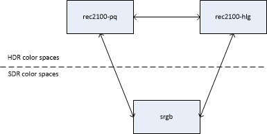

# Adding support High Dynamic Range (HDR) imagery to HTML Canvas: a baseline proposal

## Introduction

Today [HTML
Canvas](https://html.spec.whatwg.org/multipage/canvas.html#imagedata) supports
only 8 bit per color channel and two `PredefinedColorSpace` color spaces (`srgb`
and `display-p3`).

This is insufficient for High-Dynamic Range (HDR) imagery, which is in
widespread use today:

* As detailed, for example, at [Ultra HD Blu-ray Format Video Characteristics
](https://ieeexplore.ieee.org/document/7514362), 8-bit quantization (bit depth)
results in contouring and banding, even for traditional standard dynamic range
(SDR) imagery, like sRGB, which covers a typical luminance range between 0 and
100 cd/m<sup>2</sup>. These quantization artifacts become unacceptable with
High-Dynamic Range (HDR) imagery, which supports luminance ranges between 0 and
up to 10,000 cd/m<sup>2</sup>.

* As specified at [Rec. ITU-R BT.2100](https://www.itu.int/rec/R-REC-BT.2100),
two color spaces tailored for HDR imagery have been developed: BT.2100 PQ and
BT.2100 HLG. All movies and TV shows are distributed using either of these two
color spaces. Products with HDMI and/or DisplayPort interfaces also use these
color spaces for HDR support.

* To render HDR imagery, it is useful to have information on the luminance range
and color gamut that were used when authoring the image.

Accordingly, the following API modifications are needed to manipulate HDR images
in HTML Canvas:

1. add BT.2100 PQ and BT.2100 HLG color spaces to `PredefinedColorSpace`
2. add higher bit depth capabilities to `CanvasRenderingContext2DSettings`
3. add higher bit depth capabilities to `ImageDataSettings`
4. add luminance and color gamut information to `ImageDataSettings` and
   `CanvasRenderingContext2DSettings`

## Target use cases

The primary use case is the drawing of HDR images into an HTML Canvas element
such that the images are displayed as they would have been if they had been
introduced in an `img` or `video` element. Example applications include:

* drawing images retrieved from a file whose format is not supported by the
  `img` or `video` elements
* collage of images, both HDR and SDR
* drawing of visual elements that are related to an HDR video presentation, with
  the expectation that the visual elements match the look of the HDR video
  presentation.

## Scope

We propose a minimal extension to the Web Platform to allow the HTML Canvas API
to manipulate High Dynamic Range (HDR) images expressed using the widespread
BT.2100 PQ and BT.2100 HLG color spaces.

This proposal:

* does not target applications that require high-performance custom image
  tone-mapping or compositing methods.
* does not preclude adding other HDR capabilities to HTML Canvas, such as
  support for additional color spaces like a linear high-dynamic range color
  space.

## Add color spaces intended for use with HDR images

### General

Extend [`PredefinedColorSpace`](https://html.spec.whatwg.org/multipage/canvas.html#predefinedcolorspace) to
include the following color spaces.

```idl
  partial enum PredefinedColorSpace {
    'rec2100-hlg',
    'rec2100-pq',
  }
```

Extending `PredefinedColorSpace` automatically extends
`CanvasRenderingContext2DSettings` and `ImageDataSettings`.

A Canvas that is initialized with `rec2100-pq` and `rec2100-hlg` is an HDR
Canvas; otherwise it is an SDR Canvas.

As illustrated below, the tone mapping of `rec2100-pq` and `rec2100-hlg` images,
i.e. the rendering of an image with a given dynamic range onto a display with
different dynamic range, is performed by the platform. This is akin to the
scenario where the `src` of an `img` element is a PQ or HLG image.


SDR images that are drawn to an HDR Canvas are first converted to an HDR
representation. Conversely, HDR images that are drawn into SDR Canvas are first
converted to an SDR representation.

Conversions to and from `rec2100-pq` and `rec2100-hlg` are detailed in Annex A
below.

### rec2100-hlg

The non-linear component signals {R', G', B'} are mapped to red, green and blue
tristimulus values according to the Hybrid Log-Gamma (HLG) system specified in
Rec. ITU-R BT.2100.

### rec2100-pq

The non-linear component signals {R', G', B'} are mapped to red, green and blue
tristimulus values according to the Perceptual Quantizer (PQ) system system
specified in Rec. ITU-R BT.2100.

_NOTE: {R', G', B'} are in the range [0, 1], i.e. they are not expressed in
cd/m<sup>2</sup>_

## Extend `CanvasRenderingContext2DSettings` to support higher bit depths

Add to `CanvasRenderingContext2DSettings` a `CanvasDataType` member that
specifies the representation of each pixel of the [output bitmap](https://html.spec.whatwg.org/multipage/canvas.html#output-bitmap) of a
`CanvasRenderingContext2D` and `OffscreenCanvasRenderingContext2D`.

```idl
  partial dictionary CanvasRenderingContext2DSettings {
    CanvasDataType dataType = "unorm8";
  };
```

```idl
  enum CanvasDataType {
    "unorm8",
    "float16",
  };
```

When `dataType = "unorm8"`, the non-linear component signals {R', G', B'} are
quantized using full range quantization, i.e. they are multiplied by 255 and
rounded to the nearest integer. For example, R' = 0.5 is represented by the
integer value 128.

When `dataType = "float16"`, the non-linear component signals {R', G', B'} are
not quantized, i.e. R' = 0.5 is represented by the floating point value 0.5.

_NOTE: `dataType = "unorm8"` corresponds to HTML Canvas as it exists today and
should not be used to represent HDR signal, as detailed in the introduction._

## Extend `ImageDataSettings` to support higher bit depths

Add to `ImageDataSettings` a `ImageDataType` member that specifies the
conversion semantics and type of each of the items of the `data` member array of
`ImageData`.

```idl
  partial dictionary ImageDataSettings {
    ImageDataType dataType = "unorm8";
  };
```

```idl
  enum ImageDataType {
    "unorm8",
    "float16",
    "float32"
    // and potentially others
  };
```

The values `"unorm8"`, `"float16"` and `"float32"` result in `data` returning an
array with the type `Uint8ClampedArray`, `Float16Array`, `Float32Array`,
respectively.

## Add HDR rendering behavior and HDR metadata to `CanvasRenderingContext2DSettings`

Add a new CanvasColorMetadata dictionary:

```idl
dictionary CanvasColorMetadata {
  CanvasMasteringDisplayMetadata masteringDisplayMetadata;
}
```

```idl
  dictionary ColorVolume {
    // The color primaries and white point of a color volume, in CIE 1931 xy
    // coordinates.
    required double redPrimaryX;
    required double redPrimaryY;
    required double greenPrimaryX;
    required double greenPrimaryY;
    required double bluePrimaryX;
    required double bluePrimaryY;
    required double whitePointX;
    required double whitePointY;
  }
```

```idl
dictionary CanvasMasteringDisplayMetadata {
  optional ColorVolume colorVolume;
  optional double minimumLuminance;
  optional double maximumLuminance;
}
```

If present, `masteringDisplayMetadata` specifies the characteristics (the color
primaries, white point, and luminance range) of the display that was used in
mastering the image content. This information allows a destination display to
optimize tone mapping based on the relationship between its own capabilities and
those of the mastering display. [SMPTE ST
2086:2018](https://ieeexplore.ieee.org/document/8353899) specifies the semantics
and range of values permitted:
* `redPrimaryX`, `redPrimaryY`, `greenPrimaryX`, `greenPrimaryY`,
  `bluePrimaryX`, and `bluePrimaryY` are the xy coordinates, as defined in [ISO
  11664-3](https://www.iso.org/standard/74165.html) of the nominal primaries of
  the mastering display
* `whitePointX` and `whitePointY` are the xy coordinates of the nominal
  chromaticity of the white point of the mastering display
* `minimumLuminance` and `maximumLuminance` are the nominal minimum and maximum
  display luminance, respectively, of the mastering display in cd/m².

The attributes of masteringDisplayMetadata SHOULD be set if know, e.g. if
obtained from metadata contained in a source image, and omitted otherwise.

Add a mechanism for specifying this on `CanvasRenderingContext2D` and
`OffscreenCanvasRenderingContext2D`.

```idl
  partial interface CanvasRenderingContext2D/OffscreenCanvasRenderingContext2D {
    attribute CanvasColorMetadata colorMetadata;
  }
```

## Annex A: Color space conversions

### Background

In general, applications should avoid conversions between color spaces and
maintain imagery in its original color space: conversions between color spaces
are not necessarily reversible and do not necessarily result in the same image
appearance. In particular, conversion of an HDR image to SDR will result in a
significant loss of information and an SDR image that is different from the
SDR image that would have been mastered from the same source material. From that
perspective, converting from HDR to SDR imagery is similar to converting RGBA
images to 16-color palette images.

Nevertheless, the HTML specification allows color space conversion in several
scenarios, e.g., when [drawing images to a
canvas](https://html.spec.whatwg.org/multipage/canvas.html#colour-spaces-and-colour-correction),
[retrieving image data from a
canvas](https://html.spec.whatwg.org/multipage/canvas.html#dom-context-2d-getimagedata),
among others being added). The conversions between predefined SDR color spaces
are defined at <https://www.w3.org/TR/css-color-4/>, and this proposal similarly
defines conversions for HDR color spaces.

The following illustrates the conversions that are explicitly specified:



These conversions fall into two broad categories:

* conversion between HDR color spaces
* conversion between an HDR and an SDR color space (tone mapping)

### Between HDR color spaces

The conversion between `rec2100-pq` and `rec2100-hlg` is specified at [Report
ITU-R BT.2408-5, Clause 6](https://www.itu.int/pub/R-REP-BT.2408)

### From HDR to SDR color spaces

#### `rec2100-pq` to `srgb`

Tone mapping from `rec2100-pq` to `srgb` is performed using the following steps:

* apply the Parametric Tone Mapping Method specified at [SMPTE ST 2094-10, Annex
B](https://ieeexplore.ieee.org/document/9405553) using the following recommended
parameter values:
  * `TargetedSystemDisplayMaximumLuminance` = 100
  * `TargetedSystemDisplayMinimumLuminance` = 0.1
* convert to sRGB using `rec2020SDRLineartoSRGB()` below

```javascript
function rec2020SDRLineartoSRGB(r, g, b) {
  const [rt, gt, bt] = matrixXYZtoRec709(matrixBT2020toXYZ(r, g, b));
  const rp = Math.pow(rt / 100, 1/2.4);
  const gp = Math.pow(gt / 100, 1/2.4);
  const bp = Math.pow(bt / 100, 1/2.4);
  return [rp, gp, bp];
}
```

A demonstration of the method is provided at
<https://www.sandflow.com/public/tone-mapping/index.html>.

#### `rec2100-hlg` to `srgb`

_Input:_ Full-range non-linear floating-point `rec2100-hlg` pixel with black at
0.0 and diffuse white at 0.75. Values may exist outside the range 0.0 to 1.0.

_Output:_ Full-range non-linear floating-point `srgb` pixel with black at 0.0
and diffuse white at 1.0. Values may exist outside the range 0.0 to 1.0.

_Process:_

  1. Pseudo-linearize the HLG signal exploiting its backwards compatibility with
     SDR consumer displays
  2. Convert from ITU BT.2100 color space to sRGB color space
  3. Convert back to non-linear using a reciprocal transform

_Note 3_ This transform utilises the backwards compatibility of ITU-R BT.2100
HLG HDR with consumer electronic displays.  Prior to display, the gamut may need
to be limited to the range 0-1.  The simplest method is to clip values but other
gamut reduction techniques may provide better output images.

```javascript

function simpleTransform(value, systemGamma) {
  if (value < 1.0) {
    return -1.0 * Math.pow(-1.0 * value, systemGamma);
  } else {
    return Math.pow(value, systemGamma);
  } 
}

function simpleInverseTransform(value, systemGamma) {
  if (value < 1.0) {
    return -1.0 * Math.pow(-1.0 * value, 1.0 / systemGamma);
  } else {
    return Math.pow(value, 1.0 / systemGamma);
  }
}

function tonemapREC2100HLGtoSRGBdisplay(r, g, b) {
  const systemGamma = 2.2;
  const r1 = simpleTransform(r, systemGamma);
  const g1 = simpleTransform(g, systemGamma);
  const b1 = simpleTransform(b, systemGamma);
  const [r2, g2, b2] = matrixXYZtoSRGB(matrixBT2020toXYZ(r1, g1, b1));
  const r3 = simpleInverseTransform(r2, systemGamma);
  const g3 = simpleInverseTransform(g2, systemGamma);
  const b3 = simpleInverseTransform(b2, systemGamma);
  const [r4, g4, b4] = limitTosRGBGamut(r3, g3, b3);
  return [r4, g4, b4];
}
```

### From SDR to HDR color spaces

#### `srgb` to `rec2100-hlg`

See [TTML 2, Annex Q.2, steps 1-8](https://www.w3.org/TR/ttml2/#hlg-hdr).

#### `srgb` to `rec2100-pq`

See [TTML 2, Annex Q.1, steps 1-8](https://www.w3.org/TR/ttml2/#hdr-compositing)
with `tts:luminanceGain = 203/80`.
